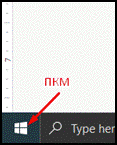
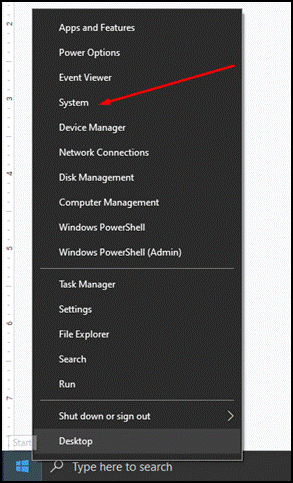
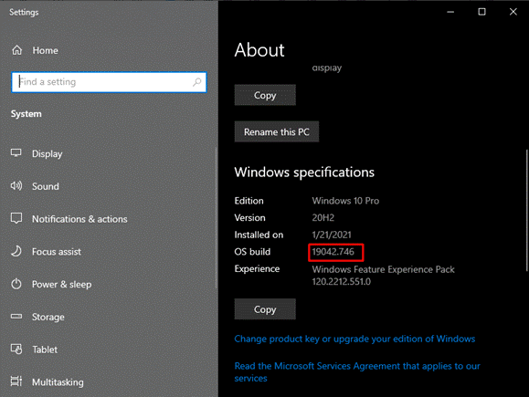
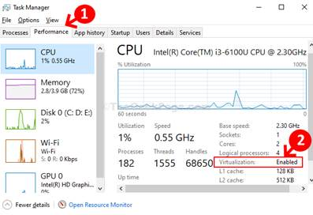
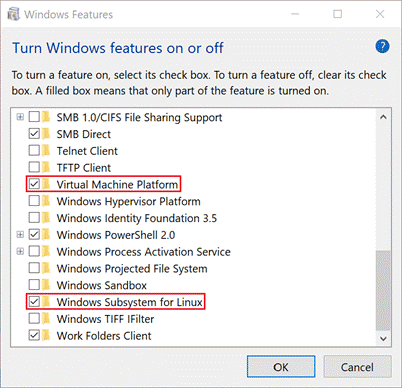
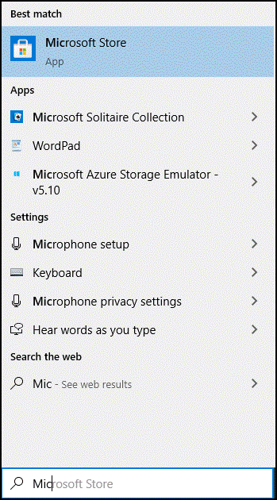
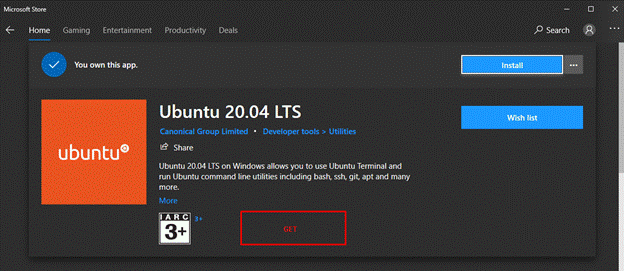
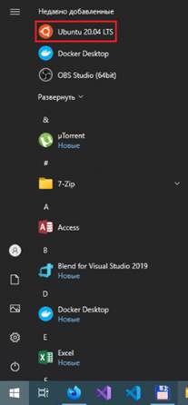

# exadel_discounts_be
MVP
# Docker and Ubuntu installation guide

<o:p>&nbsp;</o:p>

<ol style="margin-top: 0cm;" start="1" type="1">
 <li class="MsoNormal" style="">Проверяем <b style=""><i style="">Build</i></b><b style=""><i style=""> Windows</i></b>. Должен быть <b style=""><i style="">Build</i></b><b style=""><i style=""> 18362</i></b> или выше.<o:p></o:p></li>
</ol>

<o:p>&nbsp;</o:p>

<o:p>&nbsp;</o:p>

<o:p>&nbsp;</o:p>

<o:p>&nbsp;</o:p>

<o:p>&nbsp;</o:p>

<ol style="margin-top: 0cm;" start="2" type="1">
 <li class="MsoNormal" style="">В <b style=""><i style="">Task</i></b><b style=""><i style=""> </i></b><b style=""><i style="">Manager</i></b> <b style=""><i style="">(</i></b><b style=""><i style="">Ctrl</i></b><b style=""><i style="">+</i></b><b style=""><i style="">Alt</i></b><b style=""><i style="">+</i></b><b style=""><i style="">Delete</i></b><b style=""><i style="">)</i></b> нужно убедится,
     что в системе включена виртуализация и если не включена,   то проверить,
     поддерживает ли процессор и включить в BIOS.<o:p></o:p></li>
</ol>

<o:p></o:p>

<o:p>&nbsp;</o:p>

<ol style="margin-top: 0cm;" start="3" type="1">
 <li class="MsoNormal" style="">Нажимаем сочетание клавиш <b style=""><i style="">Win</i></b><b style=""><i style="">⊞</i></b><b style=""><i style=""> + R</i></b> и выполняем
     команду <b style=""><i style="">optionalfeatures</i></b>,
     откроется окно <b style=""><i style="">Windows</i></b><b style=""><i style="">
     Features</i></b>,   в котором нужно включить
     компоненты <b style=""><i style="">Virtual</i></b><b style=""><i style="">
     Machine Platform</i></b>
     и <b style=""><i style="">Windows</i></b><b style=""><i style="">
     Subsystem for Linux</i></b>, после этого нужно будет перезагрузить
     машину.<o:p></o:p></li>
</ol>

<o:p>&nbsp;</o:p>

<o:p></o:p>

<o:p>&nbsp;</o:p>

<ol style="margin-top: 0cm;" start="4" type="1">
 <li class="MsoNormal" style="">Загружаем и устанавливаем апдейт для <b style=""><i style="">WSL</i></b><b style=""><i style=""> </i></b><b style=""><i style="">2</i></b> 
     <u><a href="https://wslstorestorage.blob.core.windows.net/wslblob/wsl_update_x64.msi">https://wslstorestorage.blob.core.windows.net/wslblob/wsl_update_x64.msi</a></u><o:p></o:p></li>
</ol>

<o:p>&nbsp;</o:p>

<ol style="margin-top: 0cm;" start="5" type="1">
 <li class="MsoNormal" style="">Открываем <b style=""><i style="">PowerShell</i></b> и выполняем
     следующую команду, чтобы задать <b style=""><i style="">WSL 2</i></b>, в качестве версии по
     умолчанию при установке нового дистрибутива Linux<o:p></o:p></li>
</ol>

<b style=""><i style="">wsl</i></b><b style=""><i style=""> --</i></b><b style=""><i style="">set</i></b><b style=""><i style="">-</i></b><b style=""><i style="">default</i></b><b style=""><i style="">-</i></b><b style=""><i style="">version</i></b><b style=""><i style=""> 2</i></b><o:p></o:p>

Подробнее
в руководстве от <b style=""><i style="">Microsoft</i></b> <a href="https://docs.microsoft.com/ru-ru/windows/wsl/install-win10">https://docs.microsoft.com/ru-ru/windows/wsl/install-win10</a><o:p></o:p>

<o:p>&nbsp;</o:p>

<ol style="margin-top: 0cm;" start="6" type="1">
 <li class="MsoNormal" style="">Заходим в <b style=""><i style="">Microsoft</i></b><b style=""><i style=""> Store</i></b> и устанавливаем <b style=""><i style="">Ubuntu</i></b><b style=""><i style=""> 20.04 LTS</i></b><o:p></o:p></li>
</ol>

У меня <b style=""><i style="">Ubuntu</i></b>
уже установлена. <o:p></o:p>

<o:p>&nbsp;</o:p>

Если у вас нет аккаунта <b style=""><i style="">Microsoft</i></b> и/или у вас в системе не установлен <b style=""><i style="">Microsoft</i></b><b style=""><i style=""> Store</i></b>, то выполнить
следующие действия в <b style=""><i style="">PowerShell</i></b>:<o:p></o:p>

– заходим в папку, в которую будет загружен дистрибутив Ubuntu (примерный размер
файла 432Мб)<o:p></o:p>

<b style=""><i style="">cd</i></b><b style=""><i style=""> &lt;somefolder</i></b><b style=""><i style="">&gt;<o:p></o:p></i></b>

<o:p>&nbsp;</o:p>

– загружаем дистрибутив Ubuntu 20.04<o:p></o:p>

<b style=""><i style="">Invoke-WebRequest -Uri https://aka.ms/wslubuntu2004 -OutFile Ubuntu.appx -UseBasicParsing<o:p></o:p></i></b>

<o:p>&nbsp;</o:p>

– устанавливаем загруженный *.appx-файл

<b style=""><i style="">Add-AppxPackage .\Ubuntu.appx<o:p></o:p></i></b>

<o:p>&nbsp;</o:p>

– для завершения установки, запускаем <b style=""><i style="">Ubuntu</i></b> из меню пуск и добавляем новое <b style=""><i style="">Имя</i></b>
<b style=""><i style="">пользователя</i></b>
и <b style=""><i style="">Пароль</i></b>.<o:p></o:p>

<o:p>&nbsp;</o:p>

<o:p></o:p>

<o:p>&nbsp;</o:p>

Подробнее в руководстве от <b style=""><i style="">Microsoft</i></b> <a href="https://aka.ms/wslusers">https://aka.ms/wslusers</a><o:p></o:p>

<o:p>&nbsp;</o:p>

<ol style="margin-top: 0cm;" start="7" type="1">
 <li class="MsoNormal" style="">Загружаем, устанавливаем и запускаем <b style=""><i style="">Docker</i></b><b style=""><i style="">
     desktop for Windows</i></b>.<o:p></o:p></li>
</ol>

<a href="https://hub.docker.com/editions/community/docker-ce-desktop-windows">https://hub.docker.com/editions/community/docker-ce-desktop-windows</a><o:p></o:p>

<o:p>&nbsp;</o:p>

<ol style="margin-top: 0cm;" start="8" type="1">
 <li class="MsoNormal" style="">Если в левом нижнем углу <b style=""><i style="">Docker</i></b>, индикатор зеленый – <b style=""><i style="">Docker</i></b> готов к
     работе.<o:p></o:p></li>
</ol>

(некоторое время после запуска, индикатор будет
оранжевого цвета, главное, чтобы не красного)<o:p></o:p>

