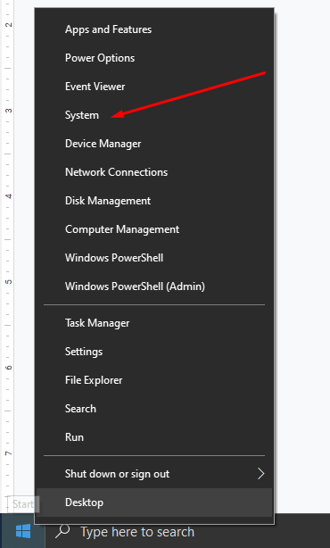
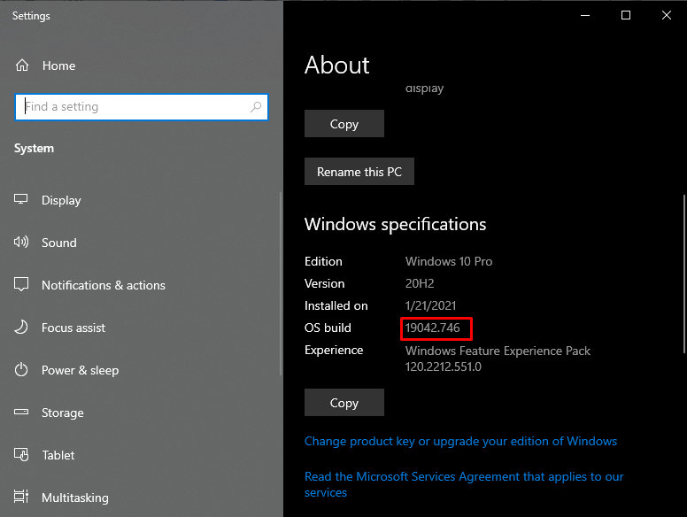
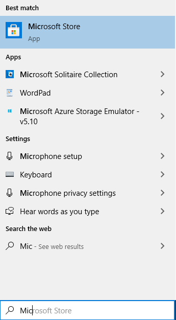
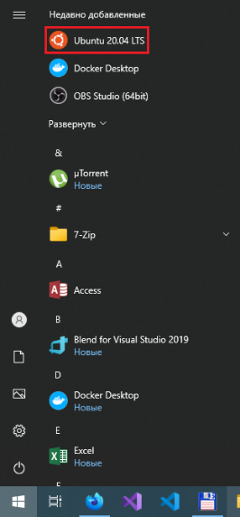
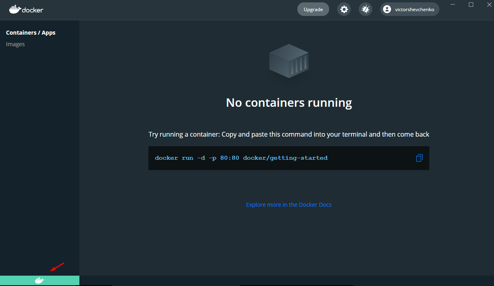

# exadel_discounts_be
MVP
# Docker and Ubuntu installation guide

1. Проверяем _**Build Windows**_. Должен быть _**Build 18362**_ или выше.





2. В _**Task Manager (Ctrl+Alt+Delete)**_ нужно убедится, что в системе включена виртуализация и если не включена,
то проверить, поддерживает ли процессор и включить в BIOS.


3. Нажимаем сочетание клавиш _**Win⊞ + R**_ и выполняем команду _**optionalfeatures**_, откроется окно _**Windows Features**_,
в  котором нужно включить компоненты _**Virtual Machine Platform**_ и _**Windows Subsystem for Linux**_,
после этого нужно будет перезагрузить машину.


4. Загружаем и устанавливаем апдейт для _**WSL 2**_
https://wslstorestorage.blob.core.windows.net/wslblob/wsl_update_x64.msi

5. Открываем _**PowerShell**_ и выполняем следующую команду, чтобы задать _**WSL 2**_,
в качестве версии по умолчанию при установке нового дистрибутива _**Linux**_
``` wsl --set-default-version 2 ```

    Подробнее в руководстве от Microsoft https://docs.microsoft.com/ru-ru/windows/wsl/install-win10

6. Заходим в _**Microsoft Store**_ и устанавливаем _**Ubuntu 20.04 LTS**_



У меня Ubuntu уже установлена


Если у вас нет аккаунта _**Microsoft**_ и/или у вас в системе не установлен _**Microsoft Store**_, то выполнить следующие действия в _**PowerShell**_:

- заходим в папку, в которую будет загружен дистрибутив Ubuntu (примерный размер файла 432Мб)
``` cd <somefolder> ```

- загружаем дистрибутив Ubuntu 20.04
``` Invoke-WebRequest -Uri https://aka.ms/wslubuntu2004 -OutFile Ubuntu.appx -UseBasicParsing ```

- устанавливаем загруженный *.appx-файл
``` Add-AppxPackage .\Ubuntu.appx ```

- для завершения установки, запускаем Ubuntu из меню пуск и добавляем новое _**Имя пользователя**_ и _**Пароль**_.



Подробнее в руководстве от Microsoft https://aka.ms/wslusers

7. Загружаем, устанавливаем и запускаем _**Docker desktop for Windows**_.
https://hub.docker.com/editions/community/docker-ce-desktop-windows

8. Если в левом нижнем углу _**Docker**_, индикатор зеленый – _**Docker**_ готов к работе.
Некоторое время после запуска, индикатор будет оранжевого цвета, главное, чтобы не красного


